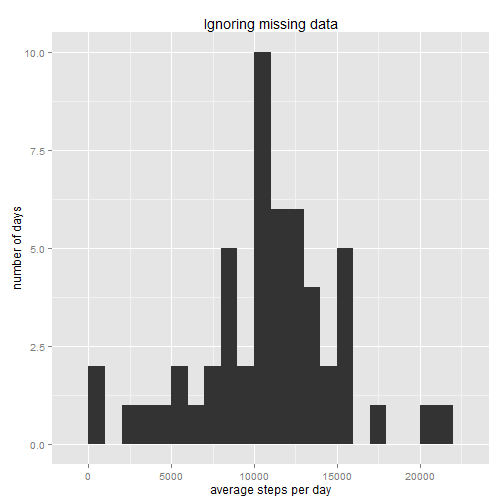
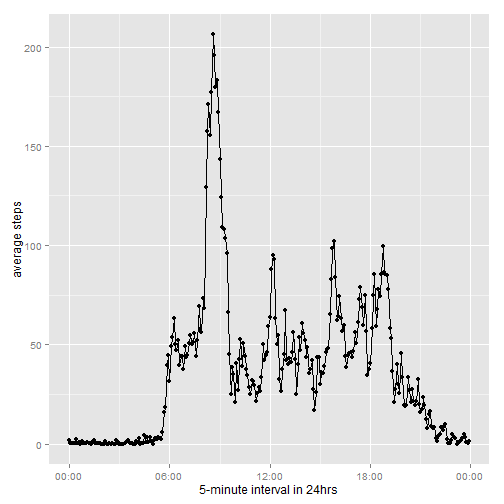
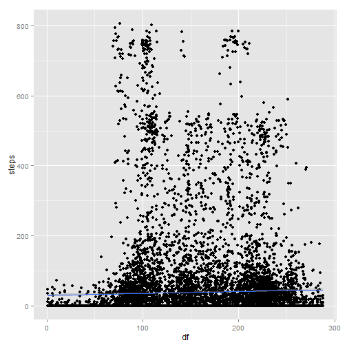
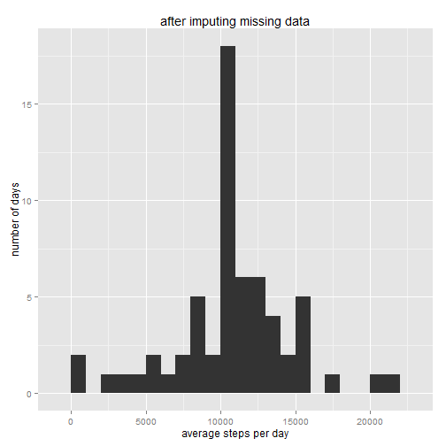
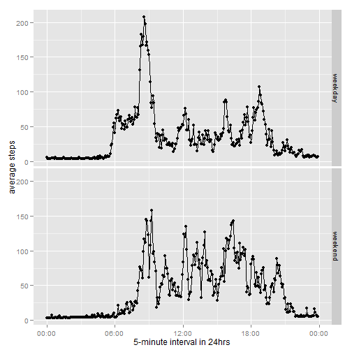

# Reproducible Research: Peer Assessment 1


## 1. Loading and preprocessing the data

### 1.1. Load the data (i.e. read.csv())

It is reproducible.


```r

getwd()
if (!file.exists("./data")) {
    dir.create("./data")
}
fileUrl <- "https://d396qusza40orc.cloudfront.net/repdata%2Fdata%2Factivity.zip"
download.file(fileUrl, destfile = "./data/activity.zip")  #Window user
```

```
## Error: unsupported URL scheme
```

```r
unzip("./data/activity.zip", exdir = "data")

data <- read.csv("./data/activity.csv")
```


### 1.2. Process/transform the data (if necessary) into a format suitable for your analysis


```r

library(ggplot2)

# To change language of the environment use the following command:
Sys.setenv(LANGUAGE = "En")
# To change locale to English:
Sys.setlocale("LC_ALL", "English")
```


-------------------

## 2. What is mean total number of steps taken per day?

### 2.1. Make a histogram of the total number of steps taken each day

- Ignore NA and do not count NA as 0.
- The maximum is 21194 and the minimum is 41.
- The binwidth of this histogram is 1000.


```r
stepsDate <- tapply(data$steps, data$date, sum)
qplot(stepsDate, xlab = "average steps per day", ylab = "number of days", binwidth = 1000, 
    main = "Ignoring missing data")
```

 


### 2.2. Calculate and report the mean and median total number of steps taken per day


```r
mean(stepsDate, na.rm = T)
```

```
## [1] 10766
```

```r
median(stepsDate, na.rm = T)
```

```
## [1] 10765
```


The mean is 10766.19 and the median is 10765.


-----------------------

## 3. What is the average daily activity pattern?

### 3.1. Make a time series plot (i.e. type = "l") of the 5-minute interval (x-axis) and the average number of steps taken, averaged across all days (y-axis)


```r
min0 <- strptime(paste("000", data$interval[1:2], sep = ""), "%H%M")
min1 <- strptime(paste("00", data$interval[3:12], sep = ""), "%H%M")
min2 <- strptime(paste("0", data$interval[13:120], sep = ""), "%H %M")
min3 <- strptime(data$interval[121:288], "%H%M")
min <- c(min0, min1, min2, min3)
```


```r
require("scales")
```

```
## Loading required package: scales
```

```r
stepsDaily <- tapply(data$steps, data$interval, mean, na.rm = T)

qplot(x = min, y = stepsDaily, geom = c("point", "line"), xlab = "5-minute interval in 24hrs", 
    ylab = "average steps") + scale_x_datetime(labels = date_format("%H:%M"))
```

 


### 3.2. Which 5-minute interval, on average across all the days in the dataset, contains the maximum number of steps?


```r
stepsDaily[which(stepsDaily == max(stepsDaily, na.rm = T))]
```

```
##   835 
## 206.2
```


When it is around 8:35 am, the average steps per 5-minute hits 206 steps, the maximum.


--------------

## 4. Imputing missing values

### 4.1. Calculate and report the total number of missing values in the dataset (i.e. the total number of rows with NAs)


```r
sum(is.na(data$steps))
```

```
## [1] 2304
```


There are 2304 NAs in 'steps' column of dataset.


### 4.2. Devise a strategy for filling in all of the missing values in the dataset. The strategy does not need to be sophisticated. For example, you could use the mean/median for that day, or the mean for that 5-minute interval, etc.

Strategy: [Predicted Mean Imputation](http://www.statsols.com/predicted-mean-imputation-using-regression/)

24 hours are composed of 5-minute times 288.
If we scale down '5-minute interval' variable to [1:288], 'df', without loss of generation and regress 'steps' on 'df', the result is below:

```r
data$df <- rep(1:288, 61)
require(caret)
```

```
## Loading required package: caret
## Loading required package: lattice
```

```r
modelfit <- train(steps ~ df, data = data, method = "glm", na.action = na.omit)
summary(modelfit)
```

```
## 
## Call:
## NULL
## 
## Deviance Residuals: 
##    Min      1Q  Median      3Q     Max  
##  -45.3   -39.5   -33.2   -26.0   772.4  
## 
## Coefficients:
##             Estimate Std. Error t value Pr(>|t|)    
## (Intercept)  29.3829     1.8162   16.18  < 2e-16 ***
## df            0.0554     0.0109    5.08  3.8e-07 ***
## ---
## Signif. codes:  0 '***' 0.001 '**' 0.01 '*' 0.05 '.' 0.1 ' ' 1
## 
## (Dispersion parameter for gaussian family taken to be 12523)
## 
##     Null deviance: 191443800  on 15263  degrees of freedom
## Residual deviance: 191120444  on 15262  degrees of freedom
## AIC: 187342
## 
## Number of Fisher Scoring iterations: 2
```

```r
ggplot(data, aes(df, steps)) + geom_point() + geom_smooth(method = "lm")
```

```
## Warning: Removed 2304 rows containing missing values (stat_smooth).
## Warning: Removed 2304 rows containing missing values (geom_point).
```

 


We will use this prediction value to imputate the missing values.


```r
data$prediction <- predict(modelfit, newdata = data)
```


### 4.3. Create a new dataset that is equal to the original dataset but with the missing data filled in.


```r
data2 <- data[, c("steps", "date", "interval")]
naLoc <- which(is.na(data$steps))
for (i in naLoc) {
    data2$steps[i] <- data$prediction[i]
}

# Check
sum(is.na(data2$steps))  #0
```

```
## [1] 0
```


### 4.4. Make a histogram of the total number of steps taken each day and Calculate and report the mean and median total number of steps taken per day. Do these values differ from the estimates from the first part of the assignment? What is the impact of imputing missing data on the estimates of the total daily number of steps?


```r
stepsDate2 <- tapply(data2$steps, data2$date, sum)
qplot(stepsDate2, xlab = "average steps per day", ylab = "number of days", binwidth = 1000, 
    main = "after imputing missing data")
```

 

```r

mean(stepsDate2)
```

```
## [1] 10766
```

```r
median(stepsDate2)
```

```
## [1] 10766
```


Mean is the same with the one before imputating missing values.
Median value becomes equal to the mean value.

When we look at the change in shape of histogram, there's a slight change in distribution.
Mean doesn't change but variance gets smaller.

-------------------

## 5. Are there differences in activity patterns between weekdays and weekends?

### 5.1. Create a new factor variable in the dataset with two levels – “weekday” and “weekend” indicating whether a given date is a weekday or weekend day.


```r
weekDays <- weekdays(as.Date(data2$date))
data2$weekDays <- unlist(lapply(weekDays, function(x) {
    if (x == "Saturday" || x == "Sunday") 
        FALSE else TRUE
}))
```


### 5.2. Make a panel plot containing a time series plot (i.e. type = "l") of the 5-minute interval (x-axis) and the average number of steps taken, averaged across all weekday days or weekend days (y-axis). The plot should look something like the following, which was creating using simulated data:


```r
sub1 <- subset(data2, weekDays == TRUE)
sub2 <- subset(data2, weekDays == FALSE)

wday <- tapply(sub1$steps, sub1$interval, mean)
wend <- tapply(sub2$steps, sub2$interval, mean)

frame <- data.frame(x = rep(min, 2), y = c(wday, wend), z = c(rep("weekday", 
    288), rep("weekend", 288)))

qplot(x = x, y = y, data = frame, facets = z ~ ., geom = c("point", "line"), 
    xlab = "5-minute interval in 24hrs", ylab = "average steps") + scale_x_datetime(labels = date_format("%H:%M"))
```

 

